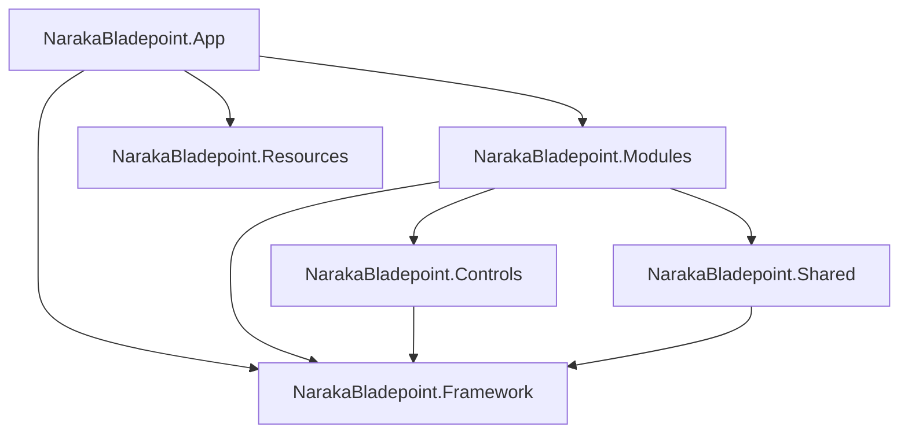

[English](README-en.md) | [中文](README.md)

# Naraka Bladepoint Client (WPF)

## Project Introduction

This is a WPF project that recreates the Naraka Bladepoint game client interface. Based on the .NET 6 platform, this project utilizes modern WPF development techniques to demonstrate how to build desktop applications with complex UI interactions.

## Learning Value

This project provides the following learning opportunities for WPF developers:

1. **Complex UI Development**: Learn how to recreate game-level complex interfaces
2. **Prism Framework Application**: Master modular development for large projects
3. **Custom Controls**: Understand the design and implementation of complex custom controls
4. **Data Binding**: Learn efficient data binding and state management
5. **Performance Optimization**: Master WPF application performance optimization techniques
6. **Zero Dependency UI Library**: Learn how to recreate and customize complex custom controls from scratch without relying on third-party UI libraries
7. **Large Project Architecture Design**: Learn reasonable architecture design for large WPF projects, including:
   - Implementation and application of dependency injection (IoC)
   - Base class encapsulation and inheritance design
   - Modularization, splitting, and decoupling strategies
   - Architecture considerations for scalability and maintainability

## Main Interface Preview

  
   
  <em>Figure 1: Main Window</em>

<table align="center">
  <tr>
    <td align="center">
       
      <em>Figure 2: Hero List</em>
    </td>
    <td align="center">
       
      <em>Figure 3: Illustrated Collection</em>
    </td>
  </tr>
  <tr>
    <td align="center">
       
      <em>Figure 4: Personal Info</em>
    </td>
    <td align="center">
       
      <em>Figure 5: Avatar List</em>
    </td>
  </tr>
  <tr>
    <td align="center">
       
      <em>Figure 6: History Data</em>
    </td>
    <td align="center">
       
      <em>Figure 7: Social Tag</em>
    </td>
  </tr>
  <tr>
    <td align="center">
       
      <em>Figure 8: Tag</em>
    </td>
    <td align="center">
       
      <em>Figure 9: Weapon</em>
    </td>
  </tr>
</table>

## Project Architecture

This project adopts a modular layered design based on **Prism**.

- **App**: Entry Shell, responsible for container initialization and module aggregation.
- **Modules**: Business logic layer (Social, Event Center, etc.), isolated by Regions.
- **Controls**: Reusable UI component library containing high-fidelity custom controls.
- **Framework**: Fundamental technical support (MVVM bases, attached properties, weak events, etc.).
- **Shared**: Cross-module contracts (DTOs, interface definitions).
- **Resources**: Static assets (icons, background images, etc.).

## Core Technical Features

### 1. Architecture Design
- Modular development using the Prism framework
- DryIoc as dependency injection container
- Modern architecture based on MVVM pattern

### 2. UI/UX Implementation
- High-quality recreation of Naraka Bladepoint game interface
- Development of complex custom controls
- Smooth animations and transition effects

### 3. Data Processing
- Efficient object mapping with Mapster
- JSON data processing with Newtonsoft.Json
- Data binding and state management

## Development Environment Requirements

### System Requirements
- Windows 10 or later
- .NET 6 SDK
- Visual Studio 2022 or later

## Build and Run

Run `NarakaBladepoint.App`

- Environment: `net6-windows`
- IDE: Visual Studio 2022 or later

## Dependencies

The project uses the following NuGet packages:

- **Mapster** Version 7.4.0 
- **Newtonsoft.Json** Version 13.0.4 
- **Prism.DryIoc** Version 9.0.537 
