[English](README-en.md) | [简体中文](README.md)

**Repository:**
- 🌐 [GitHub](https://github.com/ViewSuSu/NarakaBladepoint-WPF)
- 🌐 [Gitee](https://gitee.com/SususuChang/NarakaBladepoint-WPF)

> **Note:** Both repositories are synchronized bidirectionally. Pull requests are welcome!

> [!TIP]
> If it fails to run, ensure [.NET 6.0 SDK](https://dotnet.microsoft.com/en-us/download/dotnet/6.0) or later is installed.

# Naraka Bladepoint Client (WPF)

## About This Project

- **Motivation** - Played 2000+ hours of Naraka Bladepoint and recently realized how brilliantly designed the client's UX/UI is (props to the big-name product managers!), so I wanted to try recreating that Unity feel with WPF
- **Tech Stack** - .NET 6, Prism, all custom controls, no third-party UI libs
- **Architecture** - Meticulously designed, following strict MVVM patterns and WPF best practices, elegant code structure
- **AI** - Later discovered VibeCoding was amazing for bulk code generation - total game changer!
- **Code Quality** - Project is half human, half AI-assisted

  
   
  <em>Main Interface</em>

## What You Can Learn From This

If you're working with WPF, this project might be useful:

- **Game-level UI implementation** - Complex layouts, animations, interactions - all the real problems and solutions
- **Prism in practice** - How to split a large project into modules that work independently yet together
- **Building controls from scratch** - No third-party libraries, all custom controls written by hand, you can see all the details
- **Data binding tricks** - How to handle data flow elegantly in MVVM
- **Performance optimization** - Performance issues you'll face with complex UIs and how to solve them
- **Project architecture** - How dependency injection, base class design, and module decoupling actually work in real projects

Some parts could be better - feel free to open issues or PRs.

## More Screenshots

<table align="center" width="100%">
  <tr>
    <td align="center" width="33.33%">
       
      <em>Hero List</em>
    </td>
    <td align="center" width="33.33%">
       
      <em>Illustrated Collection</em>
    </td>
    <td align="center" width="33.33%">
       
      <em>Personal Info</em>
    </td>
  </tr>
  <tr>
    <td align="center" width="33.33%">
       
      <em>Tipping Record</em>
    </td>
    <td align="center" width="33.33%">
       
      <em>Avatar List</em>
    </td>
    <td align="center" width="33.33%">
       
      <em>History Data</em>
    </td>
  </tr>
  <tr>
    <td align="center" width="33.33%">
       
      <em>Social Tag</em>
    </td>
    <td align="center" width="33.33%">
       
      <em>Tag</em>
    </td>
    <td align="center" width="33.33%">
       
      <em>Weapon</em>
    </td>
  </tr>
</table>

## Project Architecture

Built with **Prism** for modular layers. Here's the basic structure:

```mermaid
graph LR
    App["<b>App</b><br/>Entry Point"]
    Modules["<b>Modules</b><br/>Business Logic"]
    Shared["<b>Shared</b><br/>Contracts"]
    Controls["<b>Controls</b><br/>UI Components"]
    Resources["<b>Resources</b><br/>Static Assets"]
    Framework["<b>Framework</b><br/>Core Foundation"]
    
    App -->|References| Modules
    Modules -->|References| Shared
    Shared -->|References| Controls
    Controls -->|References| Resources
    Resources -->|References| Framework
    
    style App fill:#0d1f2d,stroke:#00a8e8,stroke-width:3px,color:#e0f0ff,font-family:Monaco,font-size:13px,font-weight:bold
    style Modules fill:#1e3a5f,stroke:#0066cc,stroke-width:2px,color:#e0f0ff,font-family:Monaco,font-size:13px,font-weight:bold
    style Shared fill:#2a5a7f,stroke:#0066cc,stroke-width:2px,color:#e0f0ff,font-family:Monaco,font-size:12px,font-weight:bold
    style Controls fill:#2a5a7f,stroke:#0066cc,stroke-width:2px,color:#e0f0ff,font-family:Monaco,font-size:12px,font-weight:bold
    style Resources fill:#3a7a9f,stroke:#0066cc,stroke-width:2px,color:#e0f0ff,font-family:Monaco,font-size:12px,font-weight:bold
    style Framework fill:#4a8a9f,stroke:#0066cc,stroke-width:2px,color:#e0f0ff,font-family:Monaco,font-size:12px,font-weight:bold

```

- **App**: Entry point, handles startup and wires all modules together
- **Modules**: Individual feature modules (Social, Event Center, etc.), work independently
- **Shared**: Common interfaces and data models used across modules
- **Controls**: Custom control library, all hand-written controls
- **Resources**: Static assets like images and icons
- **Framework**: Base layer with MVVM base classes, attached properties, and common utilities

## How to Run

You'll need **Windows 10+** and **.NET 6 SDK** (or later).

Open the solution in Visual Studio 2022 and just run the `NarakaBladepoint.App` project.

## Dependencies

- Mapster 7.4.0
- Newtonsoft.Json 13.0.4
- Prism.DryIoc 9.0.537
